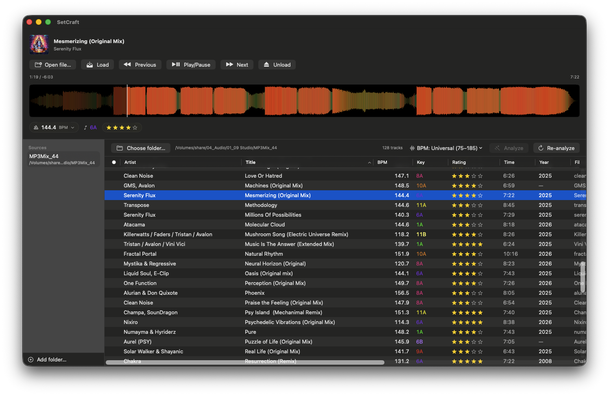
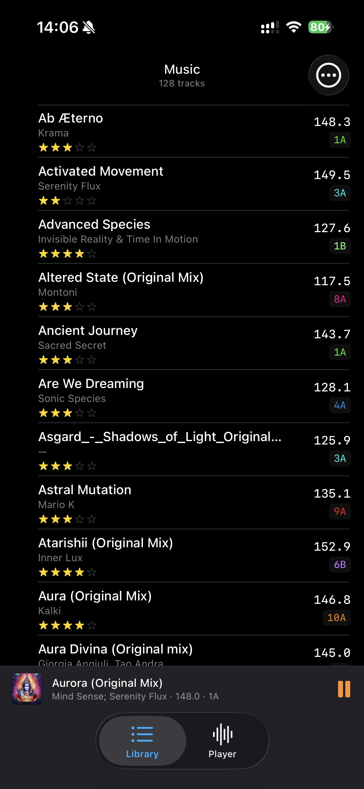
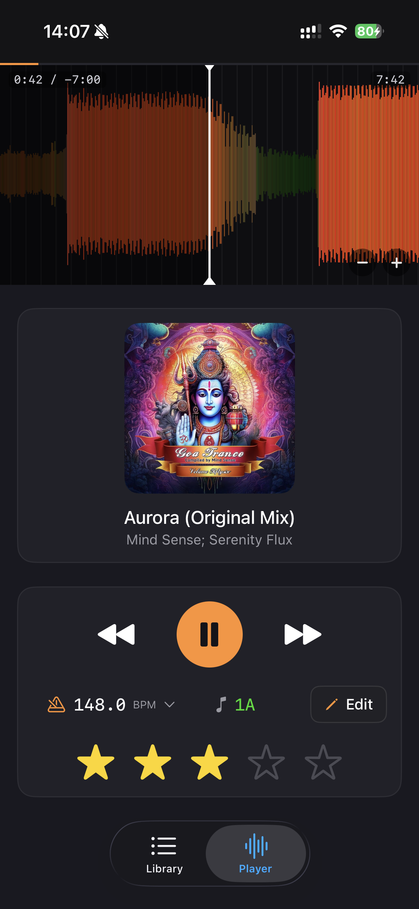

# SetCraft

A DJ-oriented music player for **macOS** and **iOS** (iPhone), written in
Swift / SwiftUI. Native, no streaming — your files, your library, your
beat-matched chops.

|  macOS  | iOS — Library  | iOS — Player  |
|:---:|:---:|:---:|
|  |  |  |

---

## Features

- **Frequency-coloured RGB waveform** (vDSP FFT, additive R = bass, G = mids,
  B = highs; SwiftUI Canvas on iOS, Metal-ready on macOS).
- **Tempo control** via `AVAudioUnitTimePitch`: per-track or set globally as
  a "master" value; every newly loaded track snaps to it. Key-lock is always
  on — speed changes don't shift pitch.
- **Editable library** (Mac: inline text fields for title, artist, BPM,
  genre, album, label, comment + clickable 5-star rating; iOS: dedicated edit
  sheet). Atomic write-back via TagLib; writes to the currently playing file
  are queued and flushed when the player switches tracks.
- **Automatic BPM and key analysis** (aubio + libKeyFinder) on track open or
  via the menu's "Analyze all" button. BPM octave correction by genre preset
  (Universal / DnB / Psy-Trance / House / HipHop / Disco), plus a ⅔ / 1½
  factor for triplet mis-detections. Re-analyze and manual ×2 / ÷2 / ×1.5 /
  ÷1.5 corrections per track from the context menu / edit sheet.
- **Camelot key colouring** in the player chip and the library, in the
  colours DJ apps have trained your eyes on (positions 1–12 around the hue
  wheel, minor saturated, major brighter).
- **Drag & drop** (macOS) loads a track into the player immediately and
  promotes its folder to a library source if it wasn't one yet.
- **iCloud Drive aware** (iOS): pick folders straight out of iCloud or any
  Files app source (incl. NAS / SMB shares mounted via the system file
  provider). Non-downloaded files are surfaced as placeholders and the
  download is triggered automatically.
- **Tag round-trip that Serato DJ and Rekordbox both honour**: ratings get
  written to both `POPM` (with Windows-Media-Player byte mapping) and a
  star-prefix in the comment field — Rekordbox ignores `POPM` but does read
  the comment.
- **Localised** (English + German, auto-switch by system language).
- **Appearance toggle** (System / Light / Dark) on the macOS app via the
  "View" menu (default: Dark). Applied through `NSApp.appearance` so AppKit
  subviews (List, Table, Canvas) follow reliably.
- **Auto-updates** (macOS) via Sparkle 2.x, EdDSA-signed. "Check for
  Updates…" menu plus a daily background poll.
- **Distribution outside the App Store** (macOS):
  `scripts/release.sh` produces a Developer-ID-signed, notarized, stapled
  DMG and pushes the Sparkle appcast in one go. See `docs/DISTRIBUTION.md`.
- **TestFlight pipeline** (iOS): `scripts/release-ios.sh` archives, exports
  and uploads to App Store Connect using an ASC API Key.
- **About panel** with full license and copyright listings for the bundled
  open-source libraries and a link back to the repo (GPL §6 compliant).

This is a private, non-commercial project — GPL-licensed libraries are
therefore fine to depend on.

> **Planning documents:** `CLAUDE.md` (project guardrails), `SPEC.md`
> (full spec and phase plan), `STATUS.md` (rolling log).
> UI sketch: open `docs/mockup-main.html` in a browser.

---

## Prerequisites

| Tool | Purpose | Install |
|---|---|---|
| Xcode (App Store) | App build, `xcodebuild`, `xcodebuild -create-xcframework` | App Store |
| Command-Line Tools | git, clang | `xcode-select --install` |
| Homebrew | build tools | https://brew.sh |
| CMake | build TagLib + fftw3 + libKeyFinder | `brew install cmake` |
| Python 3.11 | aubio build (waf doesn't run on 3.12+) | `brew install python@3.11` |

The C / C++ libraries are **not** pulled via Homebrew. They're built from
source as universal Apple `.xcframework`s and checked into
`SetCraftCore/Vendor/` so the build is reproducible.

---

## Build

### 1) Generate the `.xcframework`s (one-off, only when updating a library)

```bash
Vendor/TagLib/build-taglib.sh
Vendor/aubio/build-aubio.sh
Vendor/KeyFinder/build-keyfinder.sh
```

Each script downloads the sources, builds for `arm64 + x86_64` (macOS) and
`arm64 + arm64-simulator` (iOS) and drops the `.xcframework` into
`SetCraftCore/Vendor/`. The `Vendor/*/build/` and `Vendor/*/src/`
directories are gitignored.

Pre-built frameworks are already in the repo; you only need to run the
scripts if you bump a dependency version.

### 2) Build the apps

**macOS:**
```bash
xcodebuild -project SetCraft.xcodeproj -scheme SetCraft \
  -destination 'platform=macOS' build
```

**iOS (Simulator):**
```bash
xcodebuild -project SetCraft.xcodeproj -scheme "SetCraft iOS" \
  -destination 'platform=iOS Simulator,name=iPhone 17 Pro' build
```

Or open `SetCraft.xcodeproj` in Xcode and hit Run. The macOS target builds
as a sandboxed app with `readwrite` files-entitlement and security-scoped
bookmarks; iOS uses `UIDocumentPickerViewController` for source folders.

### 3) Tests

```bash
cd SetCraftCore && swift test
```

---

## Architecture (short version)

```
┌────────────────────────────────────────────────────┐
│ App targets                                        │
│  • SetCraft (macOS, SwiftUI + AppKit interop)      │
│  • SetCraft iOS (SwiftUI, sandboxed)               │
└──────────────────────┬─────────────────────────────┘
                       │  imports
┌──────────────────────▼─────────────────────────────┐
│ Swift Package SetCraftCore (platform-agnostic)     │
│  Models • AudioEngine • Analyzer • TrackStore      │
│  Waveform • Library • Persistence (GRDB)           │
└──────────────────────┬─────────────────────────────┘
                       │  Objective-C++ (.mm)
┌──────────────────────▼─────────────────────────────┐
│ SetCraftCoreObjC target                            │
│  SetCraftTagBridge      → TagLib                   │
│  SetCraftAnalyzerBridge → aubio + libKeyFinder     │
└──────────────────────┬─────────────────────────────┘
                       │  static libs (binaryTarget)
┌──────────────────────▼─────────────────────────────┐
│ SetCraftCore/Vendor/                               │
│  TagLib.xcframework • aubio.xcframework            │
│  KeyFinder.xcframework (fftw3 included)            │
└────────────────────────────────────────────────────┘
```

The UI only sees the protocols exposed by `SetCraftCore`; the C++
libraries stay sealed behind the ObjC++ bridge — keeps the iOS port
straightforward and the GPL components in one swappable place.

---

## Licenses

| Library | Purpose | License |
|---|---|---|
| AVFoundation, Accelerate, Metal | native | Apple |
| aubio | BPM analysis | GPLv3 |
| libKeyFinder | key analysis | GPLv3 |
| FFTW | FFT for libKeyFinder | GPLv2+ |
| TagLib | tag read / write | LGPLv2.1 / MPL |
| utfcpp | UTF helpers in TagLib | Boost SL 1.0 |
| GRDB.swift | SQLite cache | MIT |
| Sparkle | auto-update (macOS) | MIT |

Because this is private / non-commercial use, the GPL terms are not a
hassle here. Copyrights and full license texts live in the app's About
panel; the vendor build scripts under `Vendor/` make the GPLv3 sources
reproducibly available (GPL §6).
